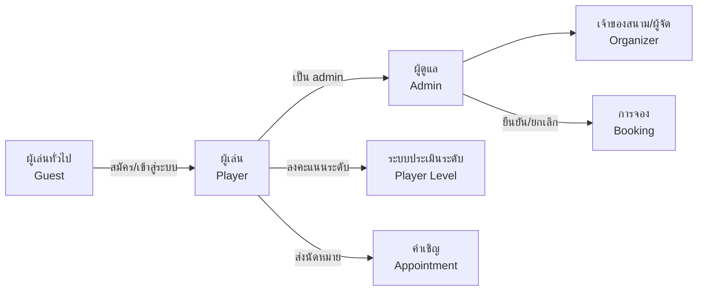
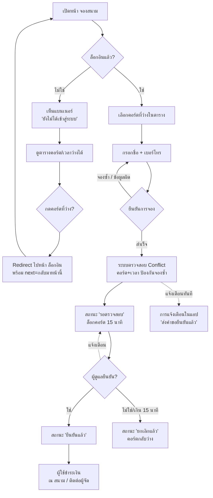
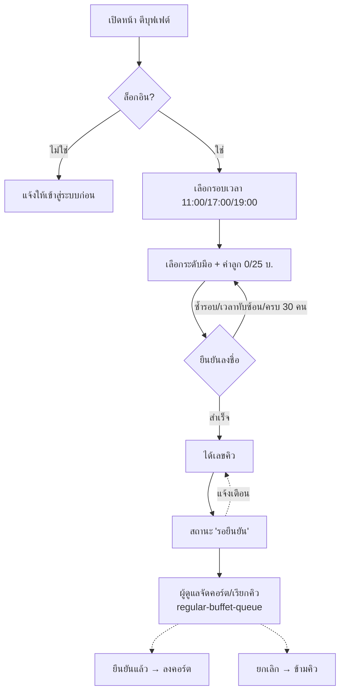
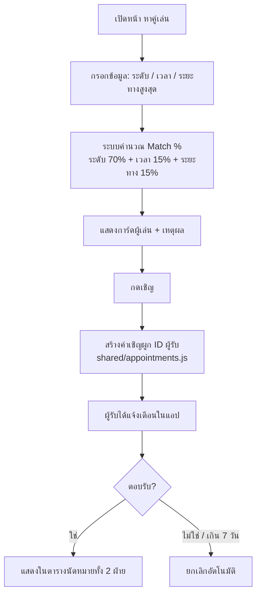
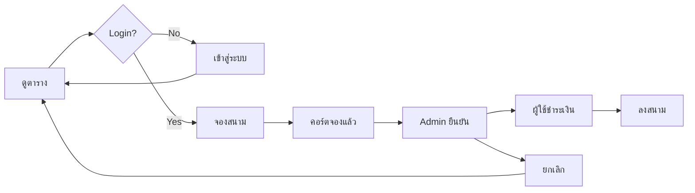

# SMASHUP — User Flow Diagram (สำหรับสอบหัวข้อ)

เอกสารนี้วาด **ลำดับการใช้งานของแต่ละ Actor** ในระบบ SMASHUP เพื่อตอบประเด็นอาจารย์:
*"must start with problem → user flow ต้อง make sense → อธิบายด้วย actor ก่อน"*

ทุก flow อ้างอิงไฟล์โค้ดจริงในโปรเจกต์ และไดอะแกรมเขียนด้วย Mermaid (เปิดดูได้ใน GitHub/Markdown หรือสไลด์ที่รองรับ Mermaid)

---

## 1. Actor ที่อยู่ในระบบ



| Actor | สิทธิ์ | เงื่อนไขเข้าถึง |
|---|---|---|
| **ผู้เล่นทั่วไป (Guest)** | ดูตารางสนาม ดูผลหาคู่ ดูหน้ากติกา | ยังไม่ต้องล็อกอิน |
| **ผู้เล่น (Player)** | จองสนาม ลงบุฟเฟต์ สมัครแข่ง ซื้อของ หาคู่ นัดหมาย ประเมินระดับ | ต้องล็อกอิน |
| **ผู้ดูแล (Admin)** | จัดการคอร์ต/ผู้ใช้ ยืนยัน/ยกเลิกรายการ ดูรายงาน จัดสายแข่ง | ต้องเป็น admin |
| **ผู้จัด (Organizer)** | ตรวจสอบระดับผู้เล่น ยืนยันระดับ | ต้องเป็น admin |

---

## 2. Flow: จองสนามคอร์ต (Flow หลัก — ถูกแก้ตามคำติอาจารย์)

> คำติจากอาจารย์: *"หน้าแรกยังไม่ล็อกอิน 'ดูได้' แต่ 'จองไม่ได้'"* + *"สลิปเงินโอน โผล่มาทั้งที่ยังไม่ทันจอง"*

`booking/index.html` + `shared/service-rules.js`



**จุดที่แก้แล้ว (logical Make sense):**
- ✏️ ผู้ที่ยังไม่ล็อกอิน **ดูได้** แต่กดจองแล้ว **ถูกนำไปล็อกอิน** แล้วกลับมาหน้านี้ (`?next=../booking/index.html`)
- ✏️ ไม่มีหน้าสลิปเงินโอนก่อนจอง — การชำระเงินเกิดขึ้น **หลังผู้ดูแลยืนยัน** เท่านั้น
- ✏️ คำถาม "กลับมาแล้วรู้ได้ไงว่าเป็นเรา" — `smashup_session_v1` ใน localStorage + หน้า *รายการของฉัน* (`my-bookings.html`) แสดงประวัติของบัญชีที่ล็อกอินเท่านั้น (ตรวจ `own()`)

---

## 3. Flow: ตีบุฟเฟต์

`booking/buffet-registration.html` + `shared/service-rules.js`



---

## 4. Flow: ระบบแข่งขัน / จัดสาย (ใหม่ — เพิ่มตามอาจารย์)

> อาจารย์: *"แบ่งตามเลเวล → จับสลาก/สุ่ม จับคู่ • แข่งรอบจนถึงรอบชิง • มีอันดับ 1/2/3"*

`booking/tournament.html` + `shared/tournament.js`

```mermaid
flowchart TD
  A[สร้างการแข่งขัน<br/>SMASHUP CHAMPIONSHIP #1] --> B[เปิดรับสมัคร]
  B --> C[ผู้เล่นสมัคร<br/>เลือกประเภท ระดับ คู่ (ถ้าคู่ผสม)]
  C -->|max 64 คน/ประเภท| D{กดสร้างสาย}
  D --> E[จัดสายตามระดับมือ<br/>มือเก่งเป็นหัวสาย กระจายกันไม่ชนรอบแรก<br/>+ สุ่มจับสลากภายในระดับเดียวกัน]
  E --> F[สร้าง Bracket<br/>R32 → R16 → รองสุดท้าย → ชิงฯ]
  F --> G[บันทึกผลแต่ละคู่<br/>winner เลื่อนขึ้นรอบ]
  G -->|จบรอบชิง| H[คำนวณอันดับ 1/2/3]
  D -.ผู้ดูแล.-> A
```

---

## 5. Flow: หาคู่เล่น (Matching)

`matching/index.html` + `shared/match-core.js`



---

## 6. Flow: วงจรการจองที่แก้ใหม่ (Development Flow)

สรุปภาพรวมกระแสงานที่ implement ในหน้าเว็บจริง:



---

## 7. สรุปคำถามคุมตรรกะ (ตอบกรรมการได้)

| คำถาม | คำตอบ |
|---|---|
| "หน้าแรกยังไม่ล็อกอิน ดูได้ไหม?" | ดูตาราง/กติกา/รายการแข่งได้ทั้งหมด แต่ต้องล็อกอินก่อนจอง |
| "กลับมาอีกครั้ง รู้ได้ไงว่าเป็นเรา" | Session `smashup_session_v1` + หน้า My Bookings แสดงเฉพาะของเจ้าของ (`own()`) |
| "สลิปโอนเงินโผล่ตอนไหน" | ไม่มีหน้าสลิปก่อนจอง — หลัง admin ยืนยัน ผู้ใช้ติดต่อ/ชำระที่สนาม |
| "จองซ้ำได้ไหม" | ไม่ได้ — conflict check คอร์ต+เวลา ทุกครั้งก่อนเขียนข้อมูล (`courtConflict`) |
| "จองแล้วจองซ้ำรอบอื่นได้ไหม" | ได้ ถ้าไม่ทับซ้อนเวลา + ยังอยู่ในหน้าต่าง 7 วัน |
| "ใครยกเลิกได้" | เฉพาะเจ้าของรายการ (`ownerId`) หรือ admin |
| "สายแข่งจัดยังไง" | จัดสายตามระดับมือ: เก่งสุดเป็นหัวสายกระจายคนละมุม (seedOrder มาตรฐาน) + สุ่มสลับตั้งระดับเดียวกัน → มือเก่งไม่ชนกันรอบแรก |